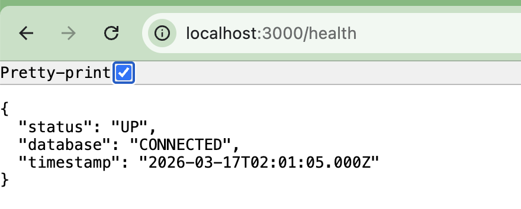
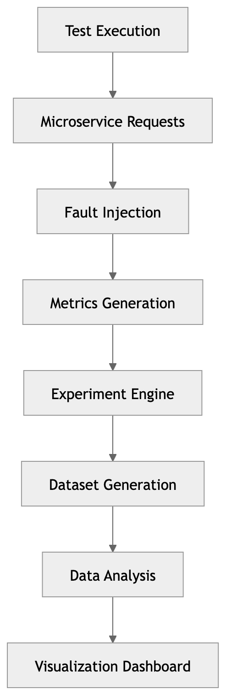

# QA Intelligence Lab

[](https://www.python.org/)
[](https://streamlit.io/)
[](https://groq.com/)
[](https://opensource.org/licenses/MIT)

A resilience testing and experimentation platform that combines:

* QA automation
* Chaos engineering
* Experiment-driven testing
* Data analysis
* Interactive dashboards

## Overview

QA Intelligence Lab is an experimental resilience testing microservice designed to simulate controlled failures and latency conditions in automated testing environments.

The system acts as a **System Under Test (SUT)** for resilience validation using automated testing frameworks and CI/CD pipelines.

This project is part of an **MSc in Data Science & Artificial Intelligence**, focusing on experimental QA engineering, reliability analysis, and future data-driven system stability modeling.

---

# Project Structure

The project is composed of three experimental components:

1. **Resilience Testing Microservice (Backend System)**
2. **Cypress Resilience Testing Framework**
3. **CI Pipeline Integration with Jenkins**
4. **Experiment Engine**
5. **Data Analysis**
6. **Streamlit Dashboard** 

Together, these components simulate a small but complete **experimental QA infrastructure**.

---

# Objectives

* Simulate probabilistic system failures
* Inject artificial latency
* Measure operational impact
* Generate structured data for resilience experimentation
* Validate automated resilience tests in a CI environment

---

# Architecture

Technologies used:

* Node.js
* Express.js
* SQLite
* Cypress
* Jenkins
* Docker

Architecture principles:

* Modular middleware-based design
* Centralized error handling
* In-memory observability layer
* Runtime-configurable fault injection
* CI-driven automated testing

---

# Component 1 — Resilience Testing Microservice

The backend service simulates unstable system behavior in a controlled and configurable way.

It exposes endpoints that allow runtime modification of system fault conditions.

## Health Endpoint



GET /health

Returns the system status and database connectivity information.

---

## Fault Injection

GET /fault
POST /fault

This endpoint allows runtime configuration of failure parameters.

Example configuration:

```
{
  "enabled": true,
  "errorProbability": 0.5,
  "latencyMs": 3000
}
```

This configuration simulates:

* 50% probabilistic service failures
* 3 seconds of artificial latency

These parameters allow controlled resilience experiments.

---

## Metrics Endpoint

GET /metrics

This endpoint exposes runtime metrics:

* Total requests
* Total errors
* Error rate (%)
* Average response time

These metrics enable basic observability for resilience experimentation.

---

# Component 2 — Cypress Resilience Testing Framework

A Cypress-based testing framework was developed to validate the system under different operational conditions.

The framework executes automated tests against the backend microservice.

Example test scenarios include:

* System remains operational when faults are disabled
* Deterministic failure simulation when fault injection is enabled
* Verification of API behavior under unstable conditions

This framework acts as the **experimental validation layer** of the system.

---

# Component 3 — CI Integration with Jenkins

The testing framework is integrated with **Jenkins running inside Docker**, enabling automated execution of resilience tests in a CI environment.

Jenkins executes Cypress using the official Docker image:

```
cypress/included:15.11.0
```

The backend service runs locally on the host machine, while Jenkins triggers the tests through a containerized Cypress environment.

To enable communication between containers and the host system, the pipeline uses:

```
http://host.docker.internal:3000
```

This setup simulates a simplified **CI/CD resilience testing pipeline**.

---

# Component 4 — Experiment Engine

Responsible for generating resilience experiments. The engine:

* Injects failure configurations
* Executes repeated health checks
* Collects runtime metrics
* Generates experiment datasets

Output:
```
experiments.json
```

---

# Component 5 — Data Analysis

A Jupyter Notebook environment used to analyze experiment results. Typical analysis includes:

* Error rate distribution
* Latency vs failure correlation
* Response time statistics

---

# Component 6 — Streamlit Dashboard

An interactive dashboard used to visualize the dataset generated by the experiment engine. Provides:

* Resilience metrics overview
* Interactive plots
* Experiment exploration

---

## Intelligence Lab Architecture
```
QAIntelligenceLab
│
├─ setup.sh
├─ README.md
│
├─ component-1-resilience-microservice
│
├─ component-2-cypress-tests
│
├─ component-3-ci-pipeline
│
├─ component-4-experiment-engine
│   └─ dataset
│
├─ component-5-data-analysis
│   └─ notebooks
│
└─ component-6-dashboard
```
---
## Data Flow



# Experimental Use Case

The system is intentionally designed for experimental QA scenarios such as:

* Automated resilience testing
* CI pipeline validation
* Controlled failure experimentation
* Early-stage observability analysis

Although the dataset generated by the system is currently small, the architecture is designed to support future experiments involving **data-driven reliability analysis and machine learning applications**.

---

# Roadmap

Future extensions may include:

* Automated metrics persistence
* Large-scale resilience test execution
* Dataset generation for reliability modeling
* Machine learning experiments for anomaly detection
* Predictive modeling of system instability

---

# Components Structure

- Component 1 — Resilience Microservice
- Component 2 — Cypress Testing Framework
- Component 3 — CI Pipeline (Jenkins + Docker)
- Component 4 — Experiment Engine
- Component 5 — Data Science Analysis
- Component 6 — Streamlit Dashboard

# Author

Cristian N.

QA Engineer with 20+ years of experience in software testing and automation.

MSc Candidate in Data Science & Artificial Intelligence.

Research interests include:

* Experimental QA engineering
* QA Architecture
* Reliability testing
* AI-assisted quality assurance
* Data-driven software stability analysis